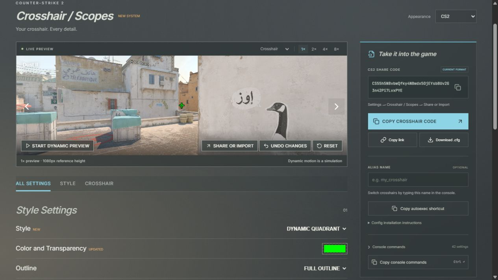

# CS2 Crosshair Studio

[delli.cc](https://delli.cc/) is a browser editor for the current Counter-Strike 2 crosshair system. Choose a style, adjust its settings, and copy a share code into the game. You can also download a config or save crosshairs in a local library.



## Use the editor

1. Choose one of the ten crosshair styles or import a code through **Share or Import**.
2. Adjust color, opacity, outline, thickness, gap, and the controls available for that style.
3. Copy the crosshair code. In CS2, open **Settings → Crosshair / Scopes → Share or Import**, paste it, and import it.

The editor has Style Settings and Crosshair Settings. Gap controls accept values from -10 to 128. The preview offers seven game backgrounds, four zoom levels, a scope dot view, and simulated dynamic motion.

Current `CS` codes carry crosshair and scope dot settings. Older `CSGO-` codes are supported with an approximation notice when conversion is needed. Config files and website links preserve additional settings. Imported console commands are parsed as data; the website does not execute them.

An optional alias such as `team_green` produces `crosshair_team_green.cfg` and this autoexec shortcut:

```cfg
alias team_green "exec crosshair_team_green.cfg"
```

Put the config in `Counter-Strike Global Offensive/game/csgo/cfg`. Add the shortcut to `autoexec.cfg`, then type `team_green` in the game console.

## Local storage and sharing

Drafts, preferences, aliases, feedback notes, up to 50 favorites, and up to 20 recent crosshairs stay in your browser. Use the library's JSON backup to save a copy elsewhere. Share links include settings in the URL, so anyone with the link can read them.

The application has no backend, accounts, or analytics. Fonts and map backgrounds are served with the site. GitHub Pages receives normal page requests. Opening an issue draft takes you to GitHub, where you can review the text before submitting it.

This replacement uses a separate `delli.v3` storage namespace. It does not automatically migrate the previous website's drafts or library. Old stored data is left in place. Legacy share-code links still work.

## Development

Use Node.js 24 and npm.

```sh
npm ci
npm run dev
```

Open `http://127.0.0.1:4180/`.

| Command | Purpose |
| --- | --- |
| `npm test` | Run codec, config, validation, and geometry tests |
| `npm run build` | Check TypeScript and build the static site into `dist` |
| `npm run check` | Run unit tests and the production build |
| `npx playwright install chromium` | Install the browser used by end-to-end tests |
| `npm run test:e2e` | Test the production build at desktop and mobile sizes |

## Verification and limits

The current codec was checked against CS2 1.41.8.8. All ten website-generated styles were imported through the running game's menu and re-exported as the exact same code. Browser tests cover editing, clipboard operations, downloads, imports, links, library actions, and preview controls.

The preview is a browser approximation. Dynamic movement, recoil, quadrant geometry, and scope rendering do not model every weapon or game state. Check your final crosshair in CS2. Earlier code conversion is approximate.

## Documentation

- [Architecture](docs/ARCHITECTURE.md)
- [Testing](docs/TESTING.md)
- [Deployment and rollback](docs/DEPLOYMENT.md)
- [Share-code protocol](docs/PROTOCOL.md)
- [Third-party notices](docs/THIRD_PARTY.md)

GitHub Actions tests the site before deploying `main` to GitHub Pages at `delli.cc`. The replacement is a normal commit, so the previous source remains in Git history.

Counter-Strike and the map preview assets belong to Valve. This project is independent and is not endorsed by Valve. No separate license for the project's source code is declared.
